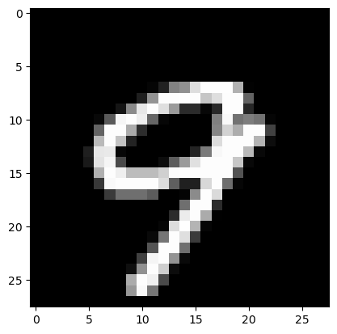
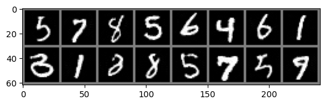
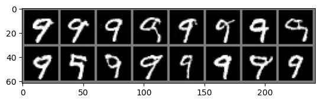
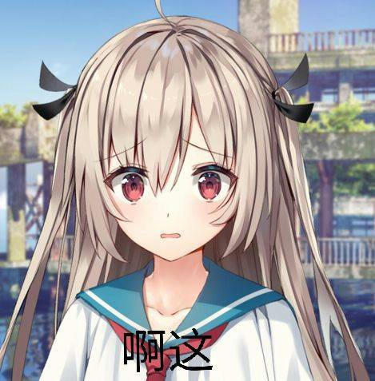
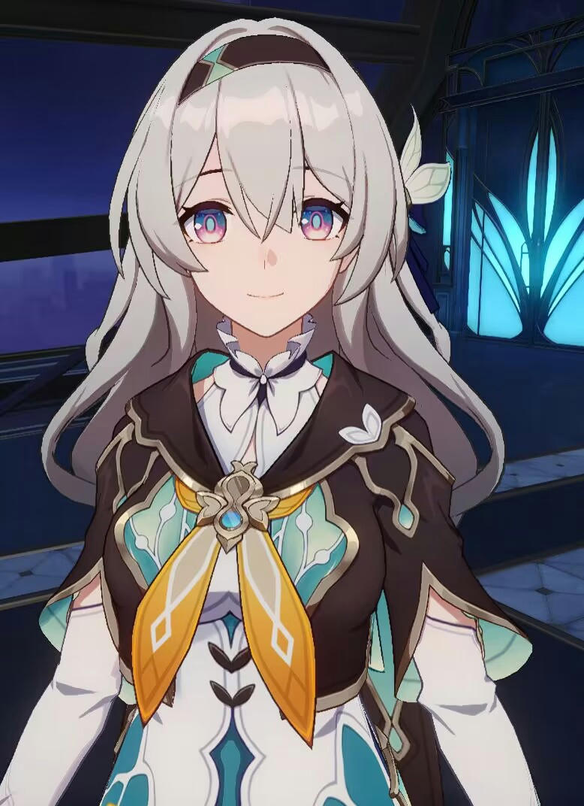
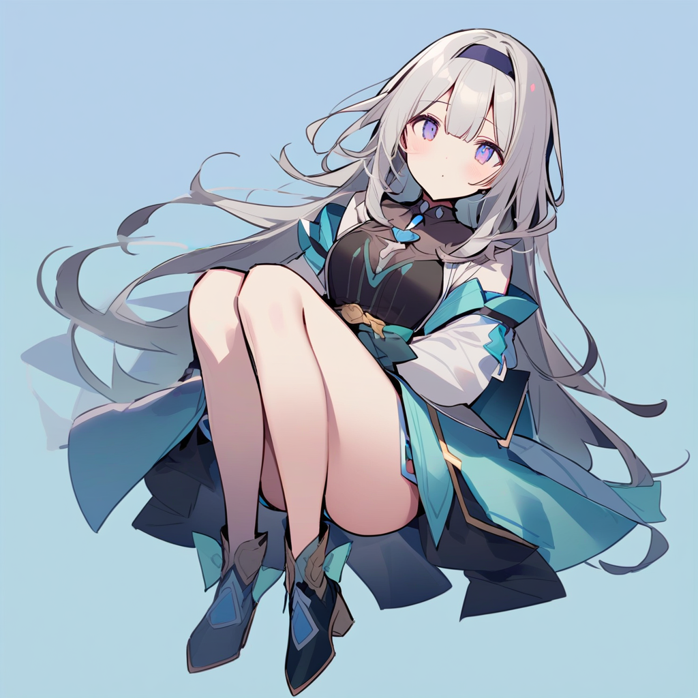

# Contrastive-Guidance

**Supervised Contrastive Guidance (SCG): guiding diffusion sampling with image similarity gradients.**

SCG uses an encoder trained with supervised contrastive learning to measure similarity between a generated sample and a reference image. During sampling, gradients of this similarity steer the output toward the reference category without retraining the models for each reference.

This repository contains a **MNIST proof of concept**. The longer-term goal is consistent character generation that preserves identity, clothing, and accessories; character-scale experiments and SDXL integration remain future work.

## MNIST results

**Reference image**



**Unconditional generation:** 16 samples from a 1,000-step DDPM, covering multiple digits.



**With SCG:** using digit 9 as the reference and a guidance scale of 2.5 steers the samples toward that digit while retaining different handwriting styles.



These qualitative examples demonstrate category guidance. They do not establish consistency of complex character details; quantitative generation metrics and systematic comparisons are still needed.

## Motivation: character details can change

The following selected Ctrl-X and IP-Adapter examples illustrate the challenge: broad visual features are retained, while clothing and accessories differ from the reference.

| Reference A | Ctrl-X |
| --- | --- |
|  |  |

| Reference B | Ctrl-X | IP-Adapter |
| --- | --- | --- |
|  |  |  |

Generation prompt:

```text
1 girl, smile, long hair, white hair, full body, simple background
```

These are motivating failure cases, not SCG outputs or a systematic benchmark of either method.

## Method

1. **Train a diffusion model.** A CNN U-Net learns noise prediction on the 60,000-image MNIST training set.
2. **Learn similarity.** A time-conditioned CNN encoder is trained on noisy images with class labels and supervised contrastive loss. It produces normalized 10-dimensional embeddings whose dot product measures similarity.
3. **Guide sampling.** Compute the gradient of similarity with respect to the current image and update it in the direction of increasing similarity, keeping model weights fixed.

The guiding idea in score form is:

$$
s_{\mathrm{guided}}(x_t,t;c)
= s_\theta(x_t,t) + \gamma\,\nabla_{x_t} S(x_t,c).
$$

Here, $x_t$ is the noisy sample, $c$ is the reference, and $\gamma$ controls guidance strength. In the current implementation, similarity is computed as:

$$
S(x_t,c)=e(x_t,t)^\top e(c,0).
$$

[`DiffusionPipeline.cond_sample`](diffusion/ddpm.py) applies `z = z + s * grads` after each non-final DDPM update. The reference is encoded at the default timestep 0, without adding noise. The sampling interface currently supports a single reference; averaging similarity across multiple references is a possible extension.

## Usage

Open [`sample.ipynb`](sample.ipynb) from the repository root to load the provided weights and generate images. The notebook requires a Jupyter environment with PyTorch, torchvision, NumPy, and Matplotlib. The current example uses CUDA directly.

| File | Purpose |
| --- | --- |
| [`sample.ipynb`](sample.ipynb) | Load both models, select a reference, and run guided sampling |
| [`train.ipynb`](train.ipynb) | Train the unconditional diffusion U-Net |
| [`train_c.ipynb`](train_c.ipynb) | Train the contrastive encoder on noisy images |
| [`diffusion/ddpm.py`](diffusion/ddpm.py) | Unconditional DDPM sampling and similarity guidance |
| [`contrastive_feature/encoder.py`](contrastive_feature/encoder.py) | Time-conditioned image encoder |
| [`contrastive_feature/loss.py`](contrastive_feature/loss.py) | Supervised contrastive loss |

Included checkpoints:

- U-Net: `good_unet_ckpt/checkpoint_150_32.pth`
- Encoder: `exp_20241111-004319_c/checkpoint_30.pth`

Before running:

- Replace Windows-style backslashes in notebook checkpoint paths with the `/` paths above when using Linux or macOS.
- The notebook selects the first image of a shuffled test batch and uses guidance strength `1.5`. To explore the digit-9 setup shown above, select a reference with label `9` and set the strength argument of `cond_sample` to `2.5`. This does not guarantee exact reproduction of the displayed images.
- Use `pipe.ddpm_sample(16)` for unconditional sampling. Both sampling methods use the configured 1,000 DDPM steps.

## Future work

- Scale the similarity encoder with a ViT backbone and larger character-labeled datasets.
- Evaluate guidance with SDXL and alternative samplers.
- Explore multiple references and measure preservation of identity, clothing, and accessories.
- Add quantitative evaluation and controlled comparisons to assess similarity and image quality together.
